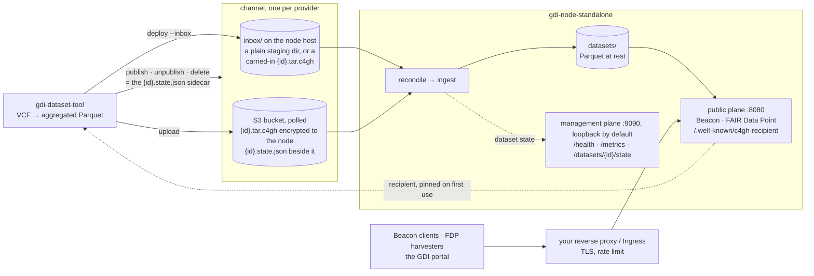
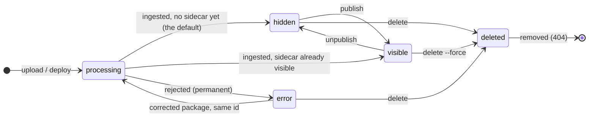
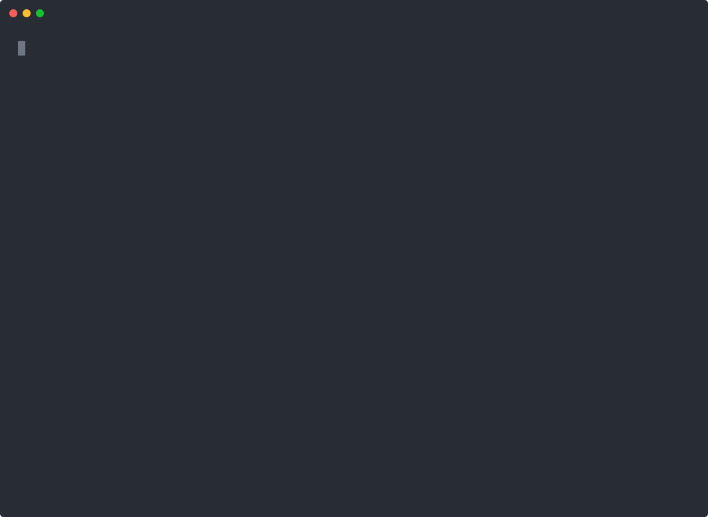
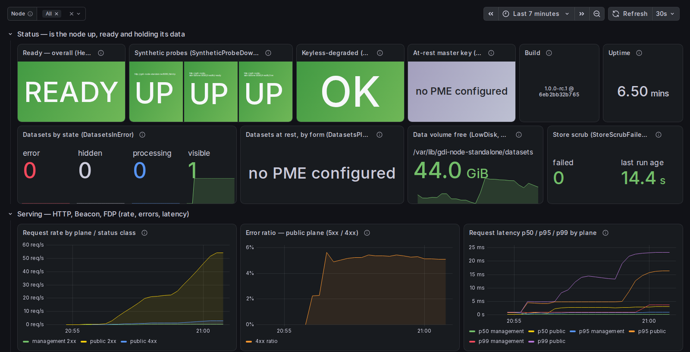

# gdi-node-standalone

> [!CAUTION]
> **Not in use, not supported. Use it at your own risk.** The Estonian GDI node (GDI-EE)
> built this to integrate with its own infrastructure and then took another route: GDI-EE
> runs its node on its own software and uses only `gdi-dataset-tool` from this repository.
> The node itself is not deployed by its authors, has no support, no roadmap and nobody on
> call, and issues or pull requests may go unanswered. If you run it, you own it.

**A small, self-contained discovery node for the European Genomic Data Infrastructure:
a GA4GH Beacon v2 and a FAIR Data Point in one binary, with the data provider's dataset
tool alongside it.**

[](#license)
[](docs/api.md)
[](docs/api.md)

The [European Genomic Data Infrastructure](https://gdi.onemilliongenomes.eu) (GDI) is a
federation of national nodes that keep their genomic data at home and answer discovery
queries in a common [GA4GH](https://www.ga4gh.org) language: does this variant exist here,
and at what frequency? This node answers that from aggregate counts and publishes the
metadata a harvester needs. It does nothing else, which is why it stays small: one process,
no database, no message bus. It runs on a laptop, and
[Quickstart 1](#quickstart-1--see-it-work) has it answering a query minutes after the build.

**Pre-release.** The tree is at `1.0.0-rc.1` and nothing is tagged, so there is no GitHub
Release, image or prebuilt binary, and everything below builds from source.
[CHANGELOG.md](CHANGELOG.md) records what `1.0.0` will commit to.

## What you get

- **Complete for discovery.** Beacon v2.2.0 with per-population allele frequencies, a FAIR
  Data Point (DCAT-AP / HealthDCAT-AP), and the catalog and dataset-state endpoints an
  operator needs. All of it is checked against the vendored GA4GH schemas
  ([conformance/](conformance/README.md)).
- **Aggregated data only, by construction.** The tool emits allele counts, never genotypes,
  and a k-anonymity floor applies at build and again at serve. The
  [threat model](docs/threat-model.md) says what that does and does not protect against.
- **Encrypted end to end.** Packages are crypt4gh, encrypted to the node's key and the
  provider's own; the tool never holds the node's secret. A co-located inbox node can run
  keyless.
- **Light at rest.** Release builds idle at about 13 MiB and store roughly 9 bytes of
  Parquet per variant per population. Concurrent paging is the memory term that matters,
  and it is not small, so size from the
  [resource baseline](docs/deployment.md#resource-baseline). The lite build makes no
  outbound connections.
- **A provider tool people can use.** A five-stage wizard, a preview of what a VCF yields
  before anything is written, a disclosure preview before anything is published, and an
  air-gapped path. Runs on Linux, macOS and Windows.
- **Operable.** Readiness per subsystem, Prometheus metrics, a Grafana dashboard with alert
  rules, a runbook from day one to disaster recovery, and a distroless non-root container
  that runs read-only. Pinned toolchain, `cargo deny`, a CycloneDX SBOM, REUSE-compliant
  licensing.

For the common cases this README should be all you need; the guides under
[`docs/`](docs/README.md) are the reference.

## Is this for you?

This is the **discovery half** of a node: no data access, no authentication or
authorisation, no record-level queries. For those, use the
[GDI starter kit](https://github.com/GenomicDataInfrastructure/starter-kit), which
assembles the full stack. This is not a drop-in replacement for its Beacon, nor the only
way to join the federation. Take it if you want a discovery node you can read and reason
about in an afternoon and are willing to own it, since nobody stands behind it. Take the
starter kit if you need access control or a maintained stack.

| You are | Start at |
| --- | --- |
| evaluating it | [Quickstart 1](#quickstart-1--see-it-work): a node serving sample data, minutes after the build |
| operating a node | [Quickstart 2](#quickstart-2--a-real-node), then [Before you go live](#before-you-go-live) |
| a data provider | the provider half of Quickstart 2, then [Providers: your own data](#providers-your-own-data) |
| integrating against the API | [Integrating](#integrating) |
| changing the code | [Contributing](#contributing) |

## How it fits together



A `{id}.state.json` sidecar beside the package decides visibility. Datasets arrive hidden
unless the sidecar already says otherwise, so nothing is served until the provider says so.
A served dataset is immutable: a correction gets a new id, and a visible dataset is never
deleted by accident.



Two keys, two owners. The operator mints the node identity
(`gdi-node-standalone identity init`) and hands out its public half; the node also serves
it at `{base_url}/.well-known/c4gh-recipient`. The tool mints the provider's own identity
on the first `package` and adds it as a second recipient, so providers can always re-open
their own packages. They never see the node's secret key. A co-located inbox node can run
keyless, since nothing crosses a trust boundary. For the design, the trust boundaries and
disclosure control, see [architecture.md](docs/architecture.md) and
[threat-model.md](docs/threat-model.md).

## Build

The service runs on Linux `x86_64` and `aarch64`, the tool also on macOS and Windows,
with MSRV **1.96** ([deployment.md § Binaries and platforms](docs/deployment.md#binaries-and-platforms)).
You need `rustup` (the pinned toolchain installs itself on first use), a C toolchain
(`build-essential`, `gcc`, or the Xcode Command Line Tools), `git` and `curl`, plus `jq` for
the query in Quickstart 1; `scripts/dev-setup.sh --check` verifies the toolchain.

```bash
git clone https://github.com/GenomicDataInfrastructure/gdi-node-standalone.git
cd gdi-node-standalone
cargo build --release -p gdi-node-standalone -p gdi-dataset-tool    # lite node + the tool (Quickstart 1)
cargo build --release -p gdi-node-standalone --features full         # node with S3, Vault and PME (Quickstart 2)
export PATH="$PWD/target/release:$PATH"
```

The first build compiles the arrow, parquet and noodles crates from source and takes tens
of minutes; later builds reuse the cache. The default **lite** node has no S3, Vault or
at-rest encryption and makes no outbound connections, which is enough for an inbox node. A
config with `[[s3.buckets]]`, `[vault]` or `[vault].transit_key` needs the **full** build;
a lite binary refuses such a config and says why. The container image is always full:
`docker build -t gdi-node-standalone:local .`, plus the two build args that stamp a git SHA
into `/version` ([deployment.md § Container image](docs/deployment.md#container-image)).

## Quickstart 1 — see it work

A keyless node reading a local inbox, serving the bundled single-variant COVID
allele-frequency sample. Nothing to author, no keys, no Docker. First the node:

```bash
mkdir -p ~/gdi-demo/inbox ~/gdi-demo/datasets
cat > ~/gdi-demo/node.toml <<EOF
[service]
base_url = "http://localhost:8080"
data_dir = "$HOME/gdi-demo/datasets"
inbox = "$HOME/gdi-demo/inbox"
rescan_interval_seconds = 10      # demo: pick up sidecars quickly (default 600)

[catalogs]
gdi-aggregated = "Genome of Europe Aggregated Data"

[beacon]
id = "org.example.af-beacon.dev"
name = "My first Beacon"
environment = "dev"
min_allele_count = 10             # k-anonymity floor, counted in alleles (~5 individuals)

[beacon.organization]
id = "org.example"
name = "Example Org"
EOF

gdi-node-standalone --config ~/gdi-demo/node.toml check-config   # preflight; prints the Beacon URLs and two smoke tests
gdi-node-standalone --config ~/gdi-demo/node.toml &
until curl -fsS http://127.0.0.1:9090/health/ready; do sleep 1; done   # health lives on the management plane
```

Now be the provider: build the sample into a staging directory, drop it into the inbox,
make it visible, query it.

```bash
gdi-dataset-tool build crates/gdi-dataset-tool/tests/fixtures/covid-package.yaml --cc EE -o build
ID=$(ls build)                          # build/ was empty; every build mints a new id
gdi-dataset-tool deploy build/$ID --inbox ~/gdi-demo/inbox --wait --management-url http://127.0.0.1:9090
gdi-dataset-tool publish $ID --inbox ~/gdi-demo/inbox   # writes {id}.state.json; the node applies it on its next scan
curl -s http://127.0.0.1:9090/datasets/$ID/state         # -> {"state":"visible",…} within rescan_interval_seconds

curl -s -X POST http://localhost:8080/aggregated/beacon/v2/g_variants \
  -H 'content-type: application/json' \
  -d '{"query":{"requestParameters":{"referenceName":"3","start":[45823239],"referenceBases":"T","alternateBases":"C","assemblyId":"GRCh38","requestedGranularity":"RECORD"}}}' \
  | jq '.responseSummary, .response.resultSets[0].results[0].frequencyInPopulations[0].frequencies[-1]'
# -> {"exists": true, "numTotalResults": 1} and the Total population: alleleCount 618 / alleleNumber 8000
```

For a Beacon that answers like a real export (1 637 sites, twelve populations, chrX/Y/M),
build the realistic sample instead and repeat the `deploy` and `publish` lines with its id:

```bash
gdi-dataset-tool build crates/test-util/tests/fixtures/sample/gdi-sample.package.yaml --cc EE -o build-sample
ID=$(ls build-sample)
```

The same node in Docker is `docker compose -f docker-compose.minimal.yml up -d --build`,
but its inbox is inside the container, so feeding it takes `docker cp` plus a `chown`
([deployment.md § Deployment shapes](docs/deployment.md#deployment-shapes)). A FAIR Data
Point needs a `[fairdp]` block; Quickstart 2 has one.

## Quickstart 2 — a real node

S3 ingest with the node's crypt4gh key on disk, no Vault and no PME. That is the usual
production shape for public aggregated data ([`node.quickstart.toml`](node.quickstart.toml),
[operating.md §0](docs/operating.md#0-quickstart-first-production-bring-up)). It needs the
full build and an S3-compatible bucket: Garage, Ceph RGW, MinIO or AWS. The `[fairdp]`
block is what makes the node a FAIR Data Point. Fill in every field, including the
publisher, the Health Data Access Body and both contact points, or delete the block for a
Beacon-only node.

**Operator**, on the node host:

```bash
sudo install -d -o "$USER" /var/lib/gdi-node-standalone/datasets /var/lib/gdi-node-standalone/keys
cp node.quickstart.toml node.toml     # replace every <SET ME: …>, the [fairdp] block included
gdi-node-standalone --config node.toml identity init --ensure   # mints the node key at [keys].identities[0] (0600) and <key>.pub; a no-op once it exists
export GDI_NODE__S3__BUCKETS__0__ACCESS_KEY_ID=… GDI_NODE__S3__BUCKETS__0__SECRET_ACCESS_KEY=…   # secrets never go in the file
gdi-node-standalone --config node.toml check-config             # refuses while any <SET ME> remains, and names each one
gdi-node-standalone --config node.toml &
until curl -fsS http://127.0.0.1:9090/health/ready; do sleep 1; done
curl -s -H 'accept: text/turtle' http://localhost:8080/fairdp   # the FDP root; datasets appear under /fairdp/dataset/<id> once published
```

**Back the key up. It is the one secret nothing can regenerate.** Hand providers the
`.pub`, or let them fetch it from `{base_url}/.well-known/c4gh-recipient`. No bucket yet?
The Compose S3 stack bundles Garage: `identity init --file compose/keys/node.c4gh`, then
`COMPOSE_PROFILES=garage docker compose -f docker-compose.yml -f docker-compose.s3.yml up -d`
([deployment.md § Deployment shapes](docs/deployment.md#deployment-shapes)).

**Operator, in Docker instead.** The same `node.toml` with in-container paths
(`data_dir = "/var/lib/gdi-node-standalone/datasets"`, `identities = ["/keys/node.c4gh"]`,
`management_addr = "0.0.0.0:9090"`). `--user` runs the container as you, so plain
directories work; if policy pins the container's user, drop it and create the directories
owned by `65532`, the image's `nonroot` user. The three hardening flags below are the ones
the Compose files use.

```bash
docker build -t gdi-node-standalone:local .                    # the full image, see Build
mkdir -p ~/gdi-node/datasets ~/gdi-node/keys
docker run --rm --user "$(id -u):$(id -g)" -v ~/gdi-node/keys:/keys \
  -v "$PWD/node.toml:/etc/gdi-node-standalone/node.toml:ro" gdi-node-standalone:local identity init --ensure
docker run -d --name gdi-node --user "$(id -u):$(id -g)" \
  --read-only --cap-drop ALL --security-opt no-new-privileges \
  -p 8080:8080 -p 127.0.0.1:9090:9090 \
  -v "$PWD/node.toml:/etc/gdi-node-standalone/node.toml:ro" -v ~/gdi-node/keys:/keys:ro \
  -v ~/gdi-node/datasets:/var/lib/gdi-node-standalone/datasets \
  -e GDI_NODE__S3__BUCKETS__0__ACCESS_KEY_ID -e GDI_NODE__S3__BUCKETS__0__SECRET_ACCESS_KEY \
  gdi-node-standalone:local                                    # GDI_CONFIG is preset in the image
until curl -fsS http://127.0.0.1:9090/health/ready; do sleep 1; done
```

Prefer Compose when you can: `docker-compose.s3.yml` is this same shape, with a bundled
dev Garage under `COMPOSE_PROFILES=garage` or against a bucket of your own
([deployment.md § Running against your own backends](docs/deployment.md#running-against-your-own-backends)).

**Provider**, on their own machine, with only the tool. The guided way is the wizard:

```bash
gdi-dataset-tool wizard
```

It asks for the node's URL, has you check the node key's fingerprint before trusting it,
then asks for the bucket and its credentials (typed hidden, stored owner-only). You
describe the dataset for the catalog; it shows which populations are about to be published,
then builds, encrypts and uploads the package, hidden. A real run against the Compose S3
stack with the realistic sample, start to finish:



`gdi-dataset-tool publish <id>` then makes the dataset visible, and the node serves it at
`/fairdp/dataset/<id>` and in the Beacon. There is a scripted equivalent for automation:
`gdi-dataset-tool config init -o tool.toml` writes a commented template, and the minimum is

```toml
country_code = "EE"
[profiles.default]
service_url = "https://your-node.example.org"
[profiles.default.s3]
endpoint = "https://s3.example.org"
bucket = "gdi-datasets"
region = "us-east-1"
path_style = true
[profiles.default.catalogs]
gdi-aggregated = "Genome of Europe Aggregated Data"
```

```bash
export GDI_TOOL__PROFILES__DEFAULT__S3__ACCESS_KEY_ID=… GDI_TOOL__PROFILES__DEFAULT__S3__SECRET_ACCESS_KEY=…
gdi-dataset-tool --config tool.toml keys pin-recipient    # fetches {service_url}/.well-known/c4gh-recipient and pins it; --file node.pub when handed over offline
gdi-dataset-tool init                                     # scaffolds package.yaml: point it at your VCFs, fill the metadata
gdi-dataset-tool --config tool.toml package package.yaml  # build + pack: <id>.tar.c4gh, encrypted to the node; mints your provider key on first use
gdi-dataset-tool --config tool.toml upload <id>.tar.c4gh  # into the bucket, hidden; the node picks it up on its next poll
gdi-dataset-tool --config tool.toml publish <id>          # flips the sidecar to visible
gdi-dataset-tool --config tool.toml status <id>           # the node's verdict, once the operator sets the bucket's write_status = true or gives you a management_url
```

Every tool field, including the co-located inbox profile and `keyless = true`:
[`tool.example.toml`](tool.example.toml).

## Before you go live

A node that works can still be wrong in these ways. Each link explains why, and what to
do about it.

- **Keep the management plane off the Ingress.** It is loopback by default and serves
  `/metrics` and the unauthenticated dataset-state endpoint. If you widen
  `[service].management_addr` for Prometheus or a kubelet, firewall it:
  [deployment.md § Bare metal](docs/deployment.md#bare-metal).
- **Front the public plane with a TLS-terminating proxy** that limits requests and
  connections per source, and set `[service].base_url` to the `https://` host clients use,
  because every FDP IRI is built from it: [§ Bare metal](docs/deployment.md#bare-metal).
- **Size for concurrent queries, not for idle.** Exports of 1 M, 10 M and 30 M variants
  take 103 MB, 992 MB and 2.96 GB on disk, and the node idles at about 13 MiB. But 32
  clients pulling 1000-row pages settle near 1 GiB on a single 1 M-variant dataset, and
  keep it after the load stops. More datasets cost throughput rather than memory, because
  `query_concurrency` bounds the fan-out. The shipped caps permit 16 GiB of RAM and some
  320 GiB of ingest scratch: [§ Resource baseline](docs/deployment.md#resource-baseline).
- **Decide `[beacon].min_allele_count`.** It defaults to `0`, which serves singleton
  counts. The unit is alleles, about two per person, so `10` means at least five people:
  [threat-model.md](docs/threat-model.md).
- **Set `[beacon].id` to the checked convention**
  `<cc>.<institution>.<af-beacon|sl-beacon>.<staging|production>`. Registering with the AF
  network also needs `[beacon].alternative_url` and `[beacon.organization].logo_url`:
  [§ Registering](docs/deployment.md#registering-with-a-beacon-network).
- **Keep secrets out of `node.toml`.** The environment overrides the file and Vault
  overrides both, so a stale `GDI_NODE__S3__BUCKETS__*` variable quietly wins over what you
  edited: [§ Which S3 credential is in force](docs/deployment.md#which-s3-credential-is-actually-in-force).
- **One provider per bucket, `allow_http = false` on every real endpoint.** Anyone with
  PUT on a bucket can publish any dataset in it, and a plaintext endpoint ships packages in
  the clear: [§ One provider per bucket](docs/deployment.md#one-provider-per-bucket--a-bucket-is-a-trust-domain).
- **One writer per data volume.** An upgrade is stop, install, `check-config`, start; on
  Kubernetes, `strategy: Recreate`:
  [operating.md §18](docs/operating.md#18-upgrades-version-skew-and-rollback).
- **Back up two things**: the node key, and the operator-override store, which a re-ingest
  cannot rebuild. The runbook wants the store on its own storage, with
  `[service].require_override_store = true` and one `gdi-node-standalone overrides init`
  before the first boot: [operating.md §17](docs/operating.md#17-disaster-recovery).

## Other ways to run it

- **Compose stacks**: four files, one image, all dev-shaped until you review the published
  ports and `allow_http`.
  - `docker-compose.minimal.yml`: Quickstart 1's keyless inbox node.
  - `docker-compose.yml -f docker-compose.s3.yml`: Quickstart 2's disk-key node, with a
    bundled Garage under `COMPOSE_PROFILES=garage`, or your own bucket via `GDI_S3_*`.
  - `docker-compose.yml` alone: Garage plus OpenBao, with the node identity in OpenBao and
    the Parquet encrypted at rest (PME).
  - `docker-compose.yml -f docker-compose.external.yml`: the node against the S3 and Vault
    you already operate; copy `.env.external.example` and fill it.

  `GDI_HOST_PORT_*` moves the ports; `scripts/dev-reset.sh --yes` wipes a stack's data and
  secrets ([deployment.md § Deployment shapes](docs/deployment.md#deployment-shapes)).
- **Kubernetes.** [`deploy/kubernetes/`](deploy/kubernetes/README.md) is a worked Kustomize
  example of the S3 shape, not a turnkey deployment: publish the image, keep the
  `overrides-init` init container, and fence the management plane off with a `NetworkPolicy`
  your CNI enforces. Read its "Before you apply" list first.
- **Vault and at-rest encryption (PME).** With a `[vault]` block the node reads its
  identity and S3 credentials from Vault or OpenBao, and `[vault].transit_key` encrypts the
  Parquet at rest (Parquet Modular Encryption). Both need the full build. Public aggregated
  data does not need PME; an encrypted volume is the baseline. Try it on the dev stack
  (root token, no TLS):
  ```bash
  docker compose up -d --build && docker compose run --rm setup && docker compose run --rm gdi-node-standalone identity init
  ```
  For a real Vault see [deployment.md § Running against your own backends](docs/deployment.md#running-against-your-own-backends);
  for key rotation and recovery, [operating.md §10](docs/operating.md#10-rotating--revoking-a-vault-transit-at-rest-key)
  and [§17](docs/operating.md#17-disaster-recovery).
- **Observability.** Add `-f docker-compose.observability.yml` to any stack for Prometheus,
  Alertmanager, Loki, Tempo, Alloy and Grafana with the shipped dashboard and alert rules
  ([compose/observability/](compose/observability/README.md)). `scripts/chaos/run.sh`
  injects faults between the node and its backends.

## Providers: your own data

You have a VCF with per-population allele counts or frequencies and you want it
discoverable through a node. Build the tool ([Build](#build)) and let the wizard walk you
through it, as in the provider half of [Quickstart 2](#quickstart-2--a-real-node). If the
node is on the same machine, `deploy --inbox` and `publish --inbox`
([Quickstart 1](#quickstart-1--see-it-work)) need no keys and no profile. Worth knowing
before your first real build:

- **Your VCF** can be on GRCh37 or GRCh38. Populations come from the INFO fields (`AF`,
  `AC` and `AN`, one set per population), and only those aggregate counts leave your
  machine. `gdi-dataset-tool preview my.vcf.gz` shows what would be published, without
  writing anything:
  [gdi-dataset-tool.md § Data requirements](docs/gdi-dataset-tool.md#data-requirements-and-constraints).
- **The floor is final.** Alleles seen fewer times than the count you choose
  (`minAlleleCount`) are left out of the package for good. When serving, the node can
  withhold more, never less.
- **The tool makes you a key** on first use, at `~/.config/gdi/keys/provider.c4gh`. It is
  the only way to open your own packages later, so back it up:
  [§ Provider-side key management](docs/gdi-dataset-tool.md#provider-side-key-management).
- **No network?** `package … --recipient node.pub` works offline; hand the encrypted file
  to the operator: [§ Offline workflow](docs/gdi-dataset-tool.md#offline--air-gapped-workflow).
- Every command and flag: [§ Command reference](docs/gdi-dataset-tool.md#command-reference).

## Operating

Health is `GET :9090/health/live` and `/health/ready` (`ready: true, degraded: true` means
a provider bucket is dark), metrics are Prometheus text at `:9090/metrics`, and a dataset's
state is `GET :9090/datasets/{id}/state`. Below is the shipped dashboard, captured on the
dev stack with the realistic sample under a few minutes of query load. The alert names in
the panel titles are the shipped Prometheus rules:



[operating.md](docs/operating.md) is the runbook: the day-one checklist, what to watch and
alert on, stuck datasets, key rotation, the dataset lifecycle, logs (`GDI_LOG`,
`LOG_FORMAT`), disaster recovery, upgrades, the audit log, and which commands are safe to
run against a serving node.

## Integrating

The public plane serves GA4GH Beacon v2.2.0 under `/aggregated/beacon/v2` (aggregated
allele frequencies; `record` granularity returns `frequencyInPopulations`) and a FAIR Data
Point under `/fairdp` (DCAT-AP / HealthDCAT-AP RDF). On the management plane,
`GET /catalogs` lists the catalog ids a package may name. The six JSON Schemas in
[`docs/`](docs/README.md#machine-readable-schemas) are the type contract for the manifest,
the sidecars and the status writeback. The full HTTP contract is in
[api.md](docs/api.md), the package format in
[package-format.md](docs/package-format.md).

## Contributing

```bash
scripts/dev-setup.sh                 # checks the toolchain and installs the pre-commit hook (--check: report only)
cargo nextest run --workspace        # or: cargo test --workspace -- --test-threads=1 (tests mutate the process env)
./scripts/ci-local.sh all            # the gate; run it before you push
```

Conventional Commits, lowercase and imperative. Build profiles, the test tiers, the MSRV
policy, adding a config field and cutting a release: [CONTRIBUTING.md](CONTRIBUTING.md).

## License

`MIT OR Apache-2.0`, at your option ([LICENSE-MIT](LICENSE-MIT),
[LICENSE-APACHE](LICENSE-APACHE)). Unless you explicitly state otherwise, any contribution
intentionally submitted for inclusion in the work by you, as defined in the Apache-2.0
license, shall be dual licensed as above, without any additional terms or conditions.

The tree is [REUSE](https://reuse.software)-compliant (`REUSE.toml`, `LICENSES/`). Every
Rust dependency is permissive or public-domain, enforced by `cargo deny`; the attribution
bundle is [THIRD-PARTY-LICENSES.md](THIRD-PARTY-LICENSES.md) and
`./scripts/ci-local.sh sbom` generates a CycloneDX SBOM. A container image also carries its
base layer under that layer's own licence:
[deployment.md § Container image](docs/deployment.md#container-image).
