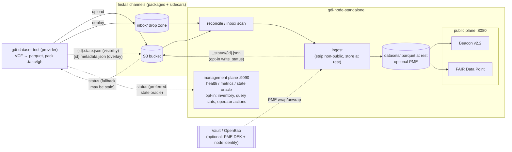

# Architecture

How `gdi-node-standalone` is built, and why it is safe to run on the open internet.
Operational procedures live in [operating.md](operating.md); the package wire format is
specified normatively in [package-format.md](package-format.md).

## System overview

A provider runs `gdi-dataset-tool` to convert VCF into aggregated Parquet and ship an
encrypted `.tar.c4gh` package over one of two install channels (an S3 bucket or a
filesystem inbox). The node reconciles that source, ingests the package (validating it,
stripping its non-public sections, storing the Parquet at rest, optionally PME-encrypted),
and serves it on two separate listeners: a public data plane and an in-cluster management
plane.

A channel carries more than packages. Alongside each `.tar.c4gh`, an orchestrator (or the
tool's `publish`, `unpublish` and `delete`) may drop sidecars: `{id}.state.json` for
visibility and `{id}.metadata.json` as a metadata overlay. The next reconcile picks them up.
That is the path for changing a published dataset without rebuilding or re-uploading it; see
[package-format.md](package-format.md#overlay-sidecars).

Solid edges are the forward publish path; dotted edges are how a provider learns the
outcome. `gdi-dataset-tool status` prefers the management-plane state oracle, but that plane
is loopback-bound by default, so a remote provider usually reaches only the
`_status/{id}.json` writeback, and only if the bucket opts in with `write_status`. With
neither reachable, a failed ingest is silent to the provider. See
[package-format.md](package-format.md#node-status-writeback-_statusidjson--the-reverse-channel).

## Workspace and crate map

A Cargo workspace (edition 2024): four library crates, two binaries, and a dev-only helper.

| Crate | Kind | Responsibility |
| --- | --- | --- |
| `gdi-node-standalone-core` (`crates/core`) | library | Shared types, config + preflight, validation, the crypt4gh codec, VCF→Parquet conversion, TAR packaging, and the ingest/overlay logic. |
| `gdi-node-standalone-beacon` (`crates/beacon`) | library | GA4GH Beacon v2.2 request/response model, request parsing and classification, and query execution with `frequencyInPopulations` assembly over Parquet. Framework-agnostic; HTTP wiring lives in the service. |
| `gdi-node-standalone-fairdp` (`crates/fairdp`) | library | FAIR Data Point / DCAT RDF emission (Turtle + JSON-LD via `oxrdf`), from one in-repo mapping table. |
| `gdi-node-standalone` (`crates/gdi-node-standalone`) | service binary | Wires config and preflight, the ingest runtime, the Beacon and FDP HTTP surfaces with their resilience layers, and `/.well-known/c4gh-recipient`. S3, Vault and PME compile in only under their features. |
| `gdi-dataset-tool` (`crates/gdi-dataset-tool`) | CLI binary | Provider tool: `build` (VCF→parquet), `validate`, `pack`, and the networked `upload`/`deploy` operations. |
| `gdi-build-info` (`crates/build-info`) | library | Build provenance captured at compile time (`GIT_SHA`, version, build epoch) via `build.rs`. Consumed by both binaries; backs `GET /version` and the `gdi_build_info` metric. Not part of the semver-checked API surface. |
| `test-util` (`crates/test-util`) | dev-only library | The one place `unsafe` is allowed: the `std::env` mutator wrappers Rust 2024 requires. Never shipped. |

Build profiles (`lite` by default, `s3`, `full`) gate the networked dependencies at compile
time; see [`CONTRIBUTING.md`](../CONTRIBUTING.md#build-profiles-the-litefull-feature-matrix).

## Data flow: ingest → overlay → query

1. **Reconcile.** The node enumerates its inbox and S3 bucket(s) and enqueues each
   package onto one bounded work queue, drained by `ingest_concurrency` worker tasks (one
   node fronts many providers through this single pool). Jobs are deduplicated by
   `datasetId`.
2. **Ingest** (per package, off the async reactor under `spawn_blocking`): a fresh
   `data_dir/.incoming/{rand}/` scratch dir → crypt4gh decrypt → safe TAR extraction →
   member-safety, layout, manifest and Parquet validation → atomic store. The store strips
   the manifest's non-public `files` and `internal` sections, drops `headers/`, makes the
   tree read-only and fsyncs it, then moves it into `data_dir/{id}/` with a single `rename`.
   Any failure cleans the scratch dir and never creates `data_dir/{id}/`, so a half-written
   dataset cannot go live. A panicking ingest becomes a permanent `error` rather than a
   crash.
3. **Overlay** (optional governance edit): an operator drops `{id}.metadata.json` beside
   the package. On the next reconcile the node merges that patch over the pristine
   `manifest.json` and re-validates it; if valid, it writes a durable
   `.metadata.overlay.json` holding the patch plus a node-stamped `applied_at`, used as
   `dct:modified`. Removing the sidecar reverts to the baseline metadata.
4. **Query.** The Beacon and FDP surfaces serve only from the in-memory metadata cache and
   the stored Parquet: scan, row-group pushdown, then `frequencyInPopulations` assembly. The
   read path is independent of ingest.

**Dataset state machine** (`DatasetState`, `crates/core/src/state.rs`):

| State | Served as | Set by |
| --- | --- | --- |
| `processing` | id and state; ephemeral, never persisted | queued, ingesting, or waiting on a transient retry |
| `visible` | full public metadata; listed | operator `{id}.state.json` = `visible` |
| `hidden` | id and state only, unlisted. The default after a successful ingest with no sidecar | operator sidecar = `hidden`, or the default |
| `error` | id, state and a sanitized closed-class message | a permanent data or validation failure |

`deleted` is sidecar tombstone vocabulary (the dataset is removed and then `404`s), not a
served state. Only `visible` and `hidden` are operator-settable; `error` and `processing`
are node-owned.

## Trust boundaries

The two-plane split is a security boundary, not a convenience (built in
`crates/gdi-node-standalone/src/app.rs`):

- **Public plane** — `[service].listen`, default `0.0.0.0:8080`: the aggregated and
  sensitive Beacon mounts, the FAIR Data Point (`/fairdp/…`), `/.well-known/c4gh-recipient`,
  and the `/` service directory, which lists the aggregated beacon prefix and `/fairdp` but
  never the sensitive mount. CORS applies only to the browser-consumed aggregated and
  combined endpoints and to the FDP, never to the well-known, sensitive or management
  surfaces. Its origin policy is wildcard `*` by default, or an exact allow-list via
  `[service].cors_allowed_origins`. The policy is stated once in `app.rs` and read by all
  three places that emit `Access-Control-Allow-Origin` (the routed `CorsLayer`, the
  unmatched-path `404`, and the resilience-error responses), so they cannot drift apart.
  CORS is a browser control, not an access control: it is no substitute for keeping a
  non-public node off the internet.
- **Management plane** — `[service].management_addr`, default `127.0.0.1:9090`: `/health/*`,
  `/version`, `/metrics`, and the `GET /datasets/{id}/state` oracle, which reveals `hidden`
  and `error` ids and their channel. It is not mounted on the public listener, so a
  misconfigured public Ingress cannot expose the hidden-dataset oracle or the metrics. The
  boundary is which router binds where, not a subtractive allow-list. The management bind is
  a hard startup requirement: the node exits rather than run unprobeable.

**Who may publish into a channel: the writer-key boundary.** Reaching a channel is not the
same as being trusted by it. Every `.tar.c4gh` header carries a crypt4gh writer key. The
node recovers its fingerprint on ingest and checks it against that channel's
`allowed_writer_fingerprints`. `[ingest].writer_policy` decides what a failed check costs:
`off`, the shipped default, does not gate at all; `warn` publishes and counts; `enforce`
quarantines. The allow-list is per channel, not per node, because a key legitimate for one
provider must not be able to publish as another. That is also why provenance records *which
channel* a dataset arrived on and carries it onto the audit trail: "who published this?" is
answerable independently of what the dataset claims about itself.

Two consequences look like node faults from the outside. A plaintext staging-dir drop
carries no crypt4gh envelope and so no writer key, so it can never be allow-listed and is
always rejected under `enforce`. And a plain `gdi-dataset-tool rekey` re-signs the header
with a fresh ephemeral writer key, changing the fingerprint, so an `enforce` node rejects
every re-keyed package; the provider must re-sign as their own key with `--as`
([gdi-dataset-tool.md](gdi-dataset-tool.md#rekey)). This boundary does not give you
confidentiality of the data at the channel (see the caveat in
[deployment.md](deployment.md)): it authenticates the producer, it does not control
disclosure of the contents.

Other boundaries. **Vault/OpenBao**, when configured, holds the node identity, per-bucket S3
credentials and the PME Transit master key. The serving process needs only `read` on the
first two and `datakey`/`decrypt` on Transit, but `identity init`, `rotate`, `retire` and
`restore` also write `[vault].kv_path`, so a read-only policy returns 403 during
provisioning and during the [operating.md §9](operating.md#9-rotating-a-node-crypt4gh-identity)
rotation. `identity backup` only reads. **S3** buckets remain the durable source, and a
bucket's `name` is its channel and provenance label. The **provider-to-node channels** are
the S3 bucket and the filesystem inbox; rejected inputs are quarantined to
`inbox/.rejected/{id}/`. The two differ in who owns the artifact afterwards: the bucket
keeps its object, while the inbox consumes what it receives, so treat a drop directory as a
hand-off rather than a copy you can re-read.

## Cryptographic architecture

**Node identity (crypt4gh).** The node holds one or more X25519 crypt4gh identities, from
either `[keys].identities` PEM files (tried in order; the first is the published recipient
served at `/.well-known/c4gh-recipient`) or a Vault KV secret (`[vault].kv_path`, which takes
precedence). Secret keys are `zeroize`-on-drop and implement neither `Debug` nor `Display`,
so they cannot be logged. An empty identity set is the valid keyless mode, which disables
encrypted-package ingest and the well-known endpoint. Rotation is add-new-then-retire-old
across a re-key window; see
[operating.md §9](operating.md#9-rotating-a-node-crypt4gh-identity).

**At-rest Parquet Modular Encryption (PME)** is optional. It compiles under the `pme`
feature, which implies `vault`, and switches on with the presence of `[vault].transit_key`:

- Each Parquet file gets its own DEK (data-encryption key), minted by a single Vault
  `transit/datakey` call as a
  32-byte footer key. The wrapped ciphertext (`vault:vN:…`) is stored in a self-describing
  `key_metadata` record on the file, naming the scheme, Transit mount, key and wrapped DEK.
- On read, the DEK comes from a `zeroize`-backed in-process cache keyed by the wrapped
  bytes, or from a single-flighted `transit/decrypt`. The cache is flushed on `SIGHUP` and on
  restart, so steady-state reads never call Vault while revocation latency stays bounded.
- The node never holds the Transit master key. Wrap and unwrap happen server-side in Vault,
  and `core`'s Parquet codec sees only opaque key bytes, never the wrapping scheme.

PME off does not mean no at-rest encryption: the baseline is then volume-level (encrypted
PVC, LUKS, node FDE), which is the right posture for public aggregated data. PME adds a
layer that keeps the wrapping key off the data volume.

## Disclosure control and its limits

The aggregated Beacon is public and unauthenticated, so small-count suppression is the
privacy control (logic in `crates/beacon/src/query.rs`, flagged security-critical):

- **Effective floor** = `max([beacon].min_allele_count, the dataset's config floor)`. A
  declared floor can be raised by the node but never lowered.
- **Symmetric suppression.** A group is suppressed when its count falls below the floor on
  either tail: the low tail (`AC`) or the complement (`AN − AC`, rare reference carriers).
  With `AN` present the complement is exact. When `AN` is withheld it is reconstructed as
  `round(AC / AF)`, rounded to nearest, the same derivation a client performs. Rounding down
  would undershoot `AN` and collapse a true single reference carrier to `refc = 0`, letting
  it survive. The three genotype sub-counts (Hom, Het, Hemi) are gated together.
- **Collapse-to-Total.** Populations form marginals: a `Total` plus per-sex, per-country and
  country×sex breakdowns that sum to it. If the floor suppresses any population in a group,
  only the aggregate `Total` is emitted, so a suppressed cell cannot be recovered by
  subtracting its surviving siblings. A group with a suppressed cell but no `Total` is
  dropped entirely. The producer (`build`) and the serving node apply this independently.
- **Incomplete-partition collapse.** The same collapse fires when nothing is suppressed at
  serve time but a partition axis' surviving members leave a remainder in `1..floor`, which
  means a below-floor cell was withheld upstream by a producer that dropped it without
  collapsing. Carrier counts are read the way a client reads them (the exact `AC` when
  present, else `round(AF × AN)`), so omitting the `AC` column cannot disable the check.

**Known limits:**

- The default `min_allele_count` is `0`, so suppression ships off. That is safe only for an
  inherently non-identifying dataset. Whenever the floor is `0` the node emits a startup
  WARN recommending one, in every environment, because the aggregated `g_variants` plane is
  unauthenticated regardless of the `environment` string or `security_level` label. The
  floor counts alleles, not individuals, so a homozygote is 2: use about `2*k` for `k`
  distinct people, that is `10` for `k = 5`.
- Suppression is not the NP-hard minimal complementary-cell solution, so a finer-grained
  partition than needed may collapse to `Total`.

[threat-model.md](threat-model.md) is authoritative on the residual risks this design
accepts: multi-variant statistical reconstruction (Homer-style membership inference, which
rides the common variants that clear every floor, so no `min_allele_count` value closes it),
and cross-dataset and cross-node differencing.
